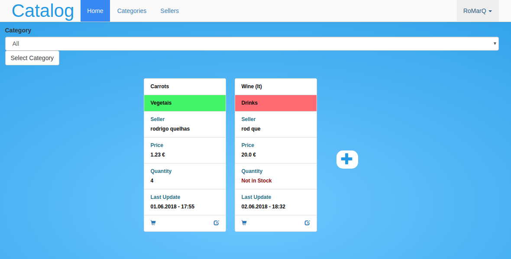

# sd-catalog-web

[ SCHOOL PROJECT - Distributed Systems ]

Sample ( Can take a few seconds to load since it probably is hibernating ) 
 [Catalog sample page](https://www.postgresql.org/) 

[ Web App  -  Java EE ]


## Features
> ##### Authentication System ( ADMIN,  SELLER and not Authenticated users )
###### ADMIN
> View, Add, Edit and Remove ( Products and Categories )
> View, Edit and Remove ( Users )
###### SELLER
> View, Add, Edit and Remove ( Products )
###### Not Authenticated
> View ( Products )

## Developed using
|                           |                                           |
| ------------------------- | ----------------------------------------- |
| Database					| [PostgreSQL](https://www.postgresql.org/)	|
| Database version control	| [Flyway](https://flywaydb.org/)			|
| Application Server		| [WildFly](http://wildfly.org/) (JBOSS)	|
| Project Manager			| [Maven](https://maven.apache.org/)		|
| App Logic 				| EJB, CDI, JPA, JTA, ...					|
| App Interface				| JSF, PrimeFaces, Bootstrap, ...			|

# Instructions

  

> Using **Maven plugin** to run the application

- Make sure you are inside the project folder
- And then run : ```mvn wildfly-swarm:run```

> Using  **IDE** to run the application
- Add ```org.wildfly.swarm.Swarm``` as main class of your project

> Running  **Jar** file
- ```mvn package```
- ```java -jar ./target/catalog-swarm.jar``` 
-  If you want to run in **production mode**, just add the following parameters
```-DJDBC_DATABASE_URL=URL```
```-DJDBC_DATABASE_USERNAME=db_username```
 ```-DJDBC_DATABASE_PASSWORD=db_password```
 ```-Sprd```

- [URL] is similar to this: ```jdbc:postgresql://localhost:5432/database_name``` 
- ```-Sprd``` flag means that application will run in production mode and use pgsql database instead of H2 module.
